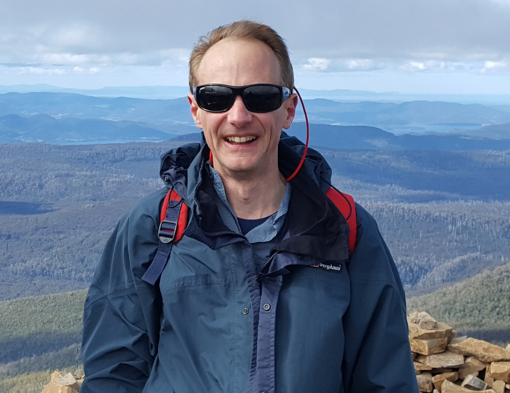
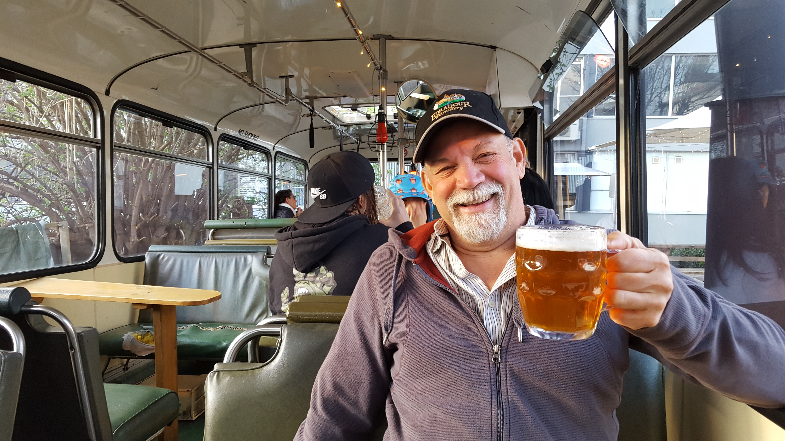

Born at a symposium on close-kin mark-recapture at the 2019 Wildlife Society / American Fisheries Society joint conference, this website represents a collaboration between Eric Anderson, Shane Baylis, Mark Bravington, Paul Conn, Hans Skaug, and Jay Ver Hoef.

