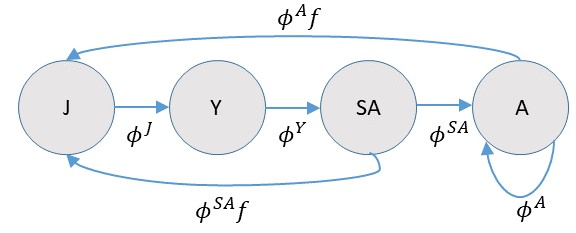

In this example, we tackle the simple case of a freely mixing population, where adults of each sex reach sexual maturity simultaneously at a known age (maturity schedules can differ for males and females), where adults all have the same expected reproductive output and survival probabilities, and where lethal sampling occurs over a number of years (with one reproductive event per year). This example is chosen because it illustrates some important concepts but is relatively simple compared to those that require age-specificity or real-world complications such as aging error.

As a general point of course, it's an extremely good idea to write down a life cycle diagram for the species that we're intrested in modeling (in this case a hypothetical one), as this will help us to write down population dynamics equations and formulate close-kin probabilities.  In particular, we need to decide whether or not to use a pre- or post-breeding census, or some variant thereof.  For this example, let's consider a post-breeding census with 4 age classes, juvenile (J), yearling (Y), sub-adult (SA) and adult (A):




If we were actually modeling recruitment directly, we would need to be careful to model recruitment into the juvenile class as a product of age-specific survival (e.g. $\phi^A$) and fertility ($f$).  Note also that the subadult class actually survives to be adults prior to breeding, so they need to be taken into account when calculating recruitment.  For many close-kin models, there will be an analagous Leslie matrix model [@Caswell2001], and since there are many places where one can go wrong when formulating matrix models [@KendallEtAl2019], one should similarly be careful when specifying close kin probabilities.

For this example, we'll largely disregard recruitment, as well as juvenile and yearling survival.  We'll also make the simplifying assumption that $\phi^{SA}=\phi^{A}$.  However, using the above diagram, it is clear that when we talk about "breeding adults" we are actually talking about both sub-adults and adults since sub-adults breed at the end of the year (thus our abundance parameter, $N_A$, represents both adults and subadults).   

One advantage of age-homogeneity in recruitment is that we can just deal with "adult" dynamics.  This is beneficial because close-kin inference does not provide information about survival of earlier age classes, and to consider a fully age-specific model we'd need to use prior distributions or auxiliary data sets to incorporate fully age-specific dynamics.  One possibility is to assume a simple exponential model where the population of "adults" (agin this is both sub-adults and adults with a post-breeding census) at time $t$, $N_t^A$, increases (or decreases) exponentially:
with rate $r$:

\begin{equation*}
  N_t^A = \left\{ 
  \begin{array}{l} 
     \exp(\nu), & \text{for } t=1 \\
     N_{t-1}^A \exp(r), & \text{for } t>1 
     \end{array}
  \right. .
\end{equation*}


For simplicity, we'll assume that there is a 50/50 sex ratio at birth.  Recall from [Inference](estimation.html) that the probability of a parent-offspring pair is given as 

\begin{equation*}
   P_{ij} = \frac{E[R_i(b_j)|{\bf z}_i,{\bf z}_j]}{E[R_+(b_j)|{\bf z}_j]},
\end{equation*}
where 

+ ${\bf z}_i,{\bf z}_j$ are covariate vectors for animals $i$ and $j$ (sex, age, etc.)
+ $R_i(b_j)$ is reproductive output of animal $i$ in $b_j$, the year of $j$'s birth.
+ $R_+(b_j)$ is the expected number of offspring in the population for year $b_j$.

According to this specification, $P_{ij}$ is very simple.  If we order comparisons so that $i$ is always the older animal, it is simply

\begin{equation*}
   P_{ij} = \left\{ 
  \begin{array}{l} 
     2/N_{b_j}^A, & \text{for } a_i(b_j) \ge a_m \\
     0, & \text{otherwise}
     \end{array}
  \right. .
\end{equation*}

The "2" is there because when we consider sexes individually, and since there is a 50/50 sex ratio, $\phi f/(0.5 \phi f N_{b_j}^A)=2/N_{b_j}^A)$. The restriction $a_i(b_j) \ge a_m$ simply indicates that there is only probability mass when the age of the prospective parent is greater or equal to the age of sexual maturity ($a_m$) in the year of $j$'s birth.  We could potentially specify different $a_m$ values for each sex, but we won't bother in this example.  Note that if juveniles are age 0, that the age at maturity according to our life cycle diagram is age 2 (since subadults breed prior to age incrementation into the "adult" class)

Let's write a little R function to calculate the probability of parent-offspring pairs under this scenario.  Note that probabilities are zero if the parent was not sexually mature at the time of $i$'s birth, or if the parent was sampled (lethally) prior to $i$'s birth.  This function also "expects" that animal $i$ is older than animals $j$:

```{r,POfunc}
get.PO.prob <- function(bi,bj,di,am,Nbj){
  return(((bj-bi)>=am)*(di>bj)*2/Nbj)
}
```

Half-siblings are a little more difficult, but not too much so.  Recall here that the probability of a half sibling pair is 

\begin{equation*}
  P_{ij} = \sum_{d}  \frac{E[R_d(b_i)]}{E[R_+(b_i)]} \frac{E[R_d(b_j)]}{E[R_+(b_j)]}.
\end{equation*}

which in our case simplifies to 

\begin{eqnarray*}
  P_{ij} & = & 0.5 N_{b_i}^A  \frac{\phi f}{0.5 \phi f N_{b_i}^A} \frac{\phi^{b_j - b_i+1}f}{0.5 \phi f N_{b_j}^A} \\
  & = & \frac{2 \phi^{b_j - b_i}}{N_{b_j}^A}.
\end{eqnarray*}

Let's write an R function for the probability of half-siblings:

```{r,HSfunc} 
get.HS.prob <- function(bi,bj,Nbj,phi){
  return(2*phi^(bj-bi)/Nbj)
}
```

It would be a huge duplication in computation if we were we use these functions to calculate probabilities for each potential parent-offspring or half-sibling pair.  In practice, it may be useful to fill in a lookup table of probabilities prior to computing a pseudo-likelihood.  Let's make functions that do this:

```{r,POtable}
get.PO.lookup.table <- function(N,nyrs,t_start,am){
  PO_table = array(0,dim=c(nyrs,nyrs,nyrs)) #dimensions are parent birth year, parent death year, offspring birth year
  for(ibi in 1:nyrs){
    for(idi in max(ibi,t_start):nyrs){
      for(ibj in 1:nyrs){
        PO_table[ibi,idi,ibj]=get.PO.prob(ibi,ibj,idi,am,N[ibj])
      }
    }
  }
  return(PO_table)
}
```

```{r,HStable}
get.HS.lookup.table <- function(N,phi,nyrs){
  HS_table = matrix(0,nyrs,nyrs) #dimensions are ind i's birth year, ind j's birth year 
  for(ibi in 1:(nyrs-1)){
    for(ibj in ibi:nyrs){  #assuming 'i' is older than 'j'; note no same cohort comparisons
      HS_table[ibi,ibj]=get.HS.prob(ibi,ibj,N[ibj],phi)
    }
  }
  return(HS_table)
}
```

Note that the inputs to these functions include a vector of adult abundance (*N*; one value for each year), number of years that we're modeling abundance (*nyrs*), the year in which genetic sampling started (*t_start*), age at maturity (*am*), and adult annual survival (*phi*; assumed consant over time).

Okay, so now we have some R functions; how would these be used with real data to write a likelihood function?  Let's start by simulating some real data.  We'll assume a 20 year time series with genetic sampling occuring for the last 10 years of the time series.  We'll set the age of sexual maturity to 3, an initial adult population size of $N_1^A=10,000$ individuals and an $r$ value of 0.01 (translating into an finite intrinsic rate of population increase of $\lambda=1.01$).  We'll set annual survival to 0.8 for adults, and sample 100 individuals every year. 

One approach would be to use individual-based simulation to simulate which individuals survive, mate, and are sampled.  By keeping track of pedigrees, one can then determine which sampled animals are related to each other.  This is the approach we take in some other examples, but for simplicity we're going to cheat a little in this example.  Specifically, we're going to specify the ages of individuals sampled in each year and then use our pre-specified probability tables to simulate whether particular matches are related to each other.  Note that we don't recommend doing this when developing your own CKMR code, as mistakes in constructing $P_{ij}$ may be introduced into both the simulation and estimation code, and may thereby go undetected.  But for simple illustration this is the approach we'll take here:


```{r,sample-size,cache=T}
set.seed(12345)
nyrs=20
t_start = 11
n_sampled=100
n_sampled_tot=n_sampled*(nyrs-t_start+1)
r=0.01
phi=0.8
am=2  #age at maturity - here subadults since they survive to adulthood before breeding and having ages incremented
N_true = rep(10000,nyrs)
for(it in 2:nyrs)N_true[it]=N_true[it-1]*exp(r)
Sampled = matrix(0,n_sampled*(nyrs-t_start+1),2) #cols are birth year,death year
Sampled[,2]=rep(c(t_start:nyrs),each=n_sampled)
#set birth year proportional to chances of surviving back in time
S_cum = rep(1,10)
for(it in 2:10)S_cum[it] = S_cum[it-1]*phi
Age_death=rmultinom(nyrs*n_sampled,1,S_cum)
for(isamp in 1:nrow(Sampled)){
  Sampled[isamp,1]=Sampled[isamp,2]-which(Age_death[,isamp]==1)+1
}
```

Okay, so now we have a matrix, *Sampled*, that includes both year of birth (first column) and year of death (2nd column), which is biased towards younger animals because few animals survive to old age.  Now we'll use our probability tables to determine which animals are related.  Note that there are 1000 sampled animals, so ${1000 \choose 2} = 499,500$ possible comparisons for each type of kinship pair (POP, HSP), which is quite a few to do individually!  While we *could* do this type of brute force loop, certainly we shoud be able to do better (especially when eventually analyzing our "data").  In statistics, large problems like this are often tackled by grouping data into sufficient statistics, which yield the exact same inference as the ungrouped data, but at greater efficiency.  For parent-offspring pairs, the probabilities associated with each comparison will be the same depending on parent's birth date, parent's death date, and offspring's birth date, let's group comparisons that way too.  Similarly, for half-siblings, let's group comparisons by birth dates.

```{r,n-comp,tidy='styler',cache=T}
n_comp_bidibj = array(0,dim=c(nyrs,nyrs,nyrs))
n_comp_bibj = matrix(0,nyrs,nyrs)
for(i in 1:(n_sampled_tot-1)){
  for(j in (i+1):n_sampled_tot){
    if(Sampled[i,1]<Sampled[j,1]){
      n_comp_bidibj[Sampled[i,1],Sampled[i,2],Sampled[j,1]]=n_comp_bidibj[Sampled[i,1],Sampled[i,2],Sampled[j,1]]+1
      n_comp_bibj[Sampled[i,1],Sampled[j,1]]=n_comp_bibj[Sampled[i,1],Sampled[j,1]]+1
    }
    if(Sampled[i,1]>Sampled[j,1]){
      n_comp_bidibj[Sampled[j,1],Sampled[j,2],Sampled[i,1]]=n_comp_bidibj[Sampled[j,1],Sampled[j,2],Sampled[i,1]]+1
      n_comp_bibj[Sampled[j,1],Sampled[i,1]]=n_comp_bibj[Sampled[j,1],Sampled[i,1]]+1
    }
  }
}
```

Note that we've omitted comparisons where birth dates are the same, which is a useful strategy for avoiding potential complications with dependent fates, and that *i* always designates the older animal.  Note also that in ``large" problems, we might want to do this step in a lower level language like C++ or TMB!

Now that we've summarized the number of comparisons in the same format as probabilities, we're in a position of simulating some CKMR data.  We'll just use a simple binomial model to simulate matches:

```{r,n-match,tidy='styler',cache=T}
n_match_PO_bidibj = array(0,dim=c(nyrs,nyrs,nyrs))
n_match_HS_bibj = matrix(0,nyrs,nyrs)
PO_table = get.PO.lookup.table(N=N_true,nyrs,t_start,am)
HS_table = get.HS.lookup.table(N=N_true,phi,nyrs)
for(ibi in 1:(nyrs-1)){
  for(ibj in (ibi+1):nyrs){
      n_match_HS_bibj[ibi,ibj]=rbinom(1,n_comp_bibj[ibi,ibj],HS_table[ibi,ibj])
      #n_match_HS_bibj[ibi,ibj]=n_comp_bibj[ibi,ibj]*HS_table[ibi,ibj] #expected value
    for(idi in ibj:nyrs){
      n_match_PO_bidibj[ibi,idi,ibj]=rbinom(1,n_comp_bidibj[ibi,idi,ibj],PO_table[ibi,idi,ibj])
      #n_match_PO_bidibj[ibi,idi,ibj]=n_comp_bidibj[ibi,idi,ibj]*PO_table[ibi,idi,ibj] note: expected values are useful for debugging.  You should get back truth (within a decimal place) if the likelihood is coded correctly
    }    
  }
}

```

Let's take a look at the total number of comparisons that were made, as well as the number of POPs and HSPs that we simulated

```{r,summarize-data,tidy='styler'}
  sum(n_comp_bibj)
  sum(n_match_PO_bidibj)
  sum(n_match_HS_bibj)
```

Note that the number of comparisons was very high, but we still only obtained 16 parent-offspring pairs and 31 half-sibling pairs.  Note this is under the ``rule of thumb" of 50 matches recommended for CKMR analysis, but we're close!

Okay, so now we have some data.  Let's fit a close-kin model to them and see if we can recover the abundance and survival parameters used to generate the data.  We'll do this first in R, using the $optimx$ function in R to minimize the negative log pseudo-likelihood; then we'll then run it through TMB to compare performance.  As usual, we'll use link functions so that parameters can be optimized on $(-\infty,\infty)$.  We'll use a binomial likelihood function, but instead of using, e.g., $dbinom$, we'll just use the kernel of the binomial pdf (the part of the log likelihood that includes parameters).  So, e.g., for the binomial model
\begin{equation*}
  {n \choose k}p^k(1-p)^{n-k},
\end{equation*}
we'll take logs and just pick out the kernel 
\begin{equation*}
  k \log(p) + (n-k) \log(1-p).
\end{equation*}
One computational issue that can arise with this approach is that $p$ can go to zero within optimization which results in a numerical error since $\log(0)$ is undefined.  So, we'll also define a function to calculate $k \log(p)$ that avoids this error.  We'll also restrict $\lambda$, the finite rate of population growth to $(0.9,1.0)$ to prevent numerical errors (such as the optimizer exploring solutions where the population crashes to near zero).


```{r,R-lik,tidy='styler',cache=T}
 n.log.p <- function(n,p){
   n * log(p+1.0*(p==0))
 }

 nll.fun <- function(Pars,Data){
   phi = plogis(Pars[1])
   N = rep(0,Data$nyrs)
   N[1]=exp(Pars[2])+100  #the '100 is to help keep abundance > 2 during optimization
   lambda = plogis(Pars[3])/5+0.9  #restrict to (0.9,1.1)
   for(it in 2:Data$nyrs)N[it]=N[it-1]*lambda
   logl = 0
   P_po = get.PO.lookup.table(N,Data$nyrs,Data$t_start,Data$am)
   P_hs = get.HS.lookup.table(N,phi,Data$nyrs)
   for(ibi in 1:(nyrs-1)){
     for(ibj in (ibi+1):Data$nyrs){
       logl = logl + n.log.p(Data$n_match_HS_bibj[ibi,ibj],P_hs[ibi,ibj]) + Data$n_no_match_HS[ibi,ibj]*log(1-P_hs[ibi,ibj]) #HSPs
       #logl = logl + dpois(Data$n_match_HS_bibj[ibi,ibj],(Data$n_match_HS_bibj[ibi,ibj]+Data$n_no_match_HS[ibi,ibj])*P_hs[ibi,ibj],log=T)  #alternative Poisson approximation
       for(idi in max(ibi,Data$t_start):Data$nyrs){
           logl = logl + n.log.p(Data$n_match_PO_bidibj[ibi,idi,ibj],P_po[ibi,idi,ibj]) + Data$n_no_match_PO[ibi,idi,ibj]*log(1-P_po[ibi,idi,ibj]) #POPs
       }
     }
   }
   return(-logl) 
 }


n_no_match_HS = n_comp_bibj-n_match_HS_bibj
n_no_match_PO = n_comp_bidibj-n_match_PO_bidibj
Data=Data_orig=list(n_match_HS_bibj=n_match_HS_bibj,n_no_match_HS=n_no_match_HS,n_match_PO_bidibj=n_match_PO_bidibj,n_no_match_PO=n_no_match_PO,nyrs=nyrs,t_start=t_start,am=am)
Par_start = c(log(phi/(1-phi)),log(10000),0.0)
Start_time = Sys.time()
Opt = optimx::optimx(par=Par_start,fn=nll.fun,hessian=TRUE,method="BFGS",Data=Data)
End_time = Sys.time()
Opt$convcode

```


Okay, it looks like the optimizer has minimized the log pseudo-likelihood successfully in a time of `r End_time-Start_time` seconds - extremely fast for a CKMR model, but then again it's not very complex. Let's examine our results.  First, annual survival is estimated as 

```{r,phi-res,tidy='styler'}
plogis(Opt$p1)
```

compared to a true value of 0.8.  The standard error can be calculated using the delta method [@Dorfman1938], where we use the Hessian of the optimization to calculate the variance-covariance matrix of parameters on untransformed space:

```{r,VC,tidy='styler',cache=T}
VC_trans = solve(attr(Opt, "details")["BFGS" ,"nhatend"][[1]])
D = diag(3)*c(exp(Opt$p1)/(1+exp(Opt$p1))^2,exp(Opt$p2),0.2*exp(Opt$p3)/(1+exp(Opt$p3))^2)#derivatives of transformations
VC_real = t(D)%*%VC_trans%*%D
SE_survival = sqrt(VC_real[1])
SE_survival
```

As an aside, I've found one of the most accessible introductions to the delta method to be in "A Gentle Introduction to Program MARK," [Appendix B](http://www.phidot.org/software/mark/docs/book/pdf/app_2.pdf) \cite{Cooch2005}.
The following plot shows estimated abundance (and trend) compared to true abundance, together with approximate 95\% [symmetric] confidence intervals 

```{r,abund-res,tidy='styler',cache=T}
N_est = rep(exp(Opt$p2)+100,nyrs)
lambda_est = plogis(Opt$p3)/5+0.9
for(it in 2:nyrs)N_est[it]=N_est[it-1]*lambda_est
D_Nlam = matrix(0,2,nyrs)
for(it in 1:nyrs)D_Nlam[1,it]=lambda_est^(it-1)  #derivative of N0*lambda^(it-1) wrt N0
for(it in 2:nyrs)D_Nlam[2,it]=lambda_est^(it-2)*N_est[1]*(it-1)+100*(it-1)*lambda_est^(it-2) #derivative of N0*lambda^(it-1) wrt lambda
VC_N = t(D_Nlam) %*% VC_real[-1,-1] %*% D_Nlam 
SE_N = sqrt(diag(VC_N))
N_lower = N_est-1.96*SE_N
N_upper = N_est+1.96*SE_N
plot_df = data.frame(Year=rep(c(1:nyrs),2),N=c(N_est,N_true),Type=c(rep("Estimated",nyrs),rep("True",nyrs)),N025=c(N_lower,N_true),N975=c(N_upper,N_true))
library(ggplot2)
ggplot(data=plot_df,aes(x=Year,y=N,color=Type))+geom_line()+geom_ribbon(aes(ymin=N025,ymax=N975),alpha=0.1)
```

There are a couple of points worth making at this point.  First, we have obtained highly reasonable estimates of survival and abundance.  Even though we have estimated a slightly declining population instead of a slightly increasing population, true values are all included within relatively large confidence intervals. Second, we see a pattern common to most CKMR time series estimates of abundance: $\hat{N}_t$ is the most precise towards the beginning and middle of the sampling period (recall sampling occurred in years 11 to 20).  It is least precise at the beginning and end.  Thus CKMR has some limitations in monitoring plans when the focus is on implementing management actions in real time as that is precisely when there is some of the greatest uncertainty. It's pretty neat that we can recover past dynamics by sampling in the present, however.

For fun (and to assess the overall performance of this model over and above a single realization), let's repeat estimation a number of times and keep track of estimator performance.  We'll focus on $\phi$, $\lambda$, and $\bar{\hat{N}}_{10:15}$, which will be the average estimated abundance in years 10 to 15.

```{r,sim,tidy='styler',warnings=F,cache=T}
  nsim = 100
  N_avg = Phi_est = Lambda_est = rep(0,nsim)
  for(isim in 1:nsim){
    n_match_PO_bidibj = array(0,dim=c(nyrs,nyrs,nyrs))
    n_match_HS_bibj = matrix(0,nyrs,nyrs)
    PO_table = get.PO.lookup.table(N=N_true,nyrs,t_start,am)
    HS_table = get.HS.lookup.table(N=N_true,phi,nyrs)
    for(ibi in 1:(nyrs-1)){
      for(ibj in (ibi+1):nyrs){
        n_match_HS_bibj[ibi,ibj]=rbinom(1,n_comp_bibj[ibi,ibj],HS_table[ibi,ibj])
        #n_match_HS_bibj[ibi,ibj]=n_comp_bibj[ibi,ibj]*HS_table[ibi,ibj] #expected value
        for(idi in ibj:nyrs){
          n_match_PO_bidibj[ibi,idi,ibj]=rbinom(1,n_comp_bidibj[ibi,idi,ibj],PO_table[ibi,idi,ibj])
        }
      }
    }
    n_no_match_HS = n_comp_bibj-n_match_HS_bibj
    n_no_match_PO = n_comp_bidibj-n_match_PO_bidibj
    Data=list(n_match_HS_bibj=n_match_HS_bibj,n_no_match_HS=n_no_match_HS,n_match_PO_bidibj=n_match_PO_bidibj,n_no_match_PO=n_no_match_PO,nyrs=nyrs,t_start=t_start,am=am)
    Par_start = c(log(phi/(1-phi)),log(10000),0.0)
    Opt = optimx::optimx(par=Par_start,fn=nll.fun,hessian=TRUE,method="BFGS",Data=Data)
    Phi_est[isim]=plogis(Opt$p1)
    Lambda_est[isim] = 0.9+0.2*plogis(Opt$p3)
    N_est = rep(exp(Opt$p2)+100,nyrs)
    for(it in 2:nyrs)N_est[it]=N_est[it-1]*Lambda_est[isim]
    N_avg[isim]=mean(N_est[10:15])
  }
```

Let's see how we did over the 100 simulations in recovering true values:

```{r,plot-sim,tidy='styler',cache=T}
  par(mfrow=c(3,1))
  hist(Phi_est)
  abline(v=phi,col='blue')
  hist(N_avg)
  abline(v=mean(N_true[10:15]),col='blue')
  hist(Lambda_est)
  abline(v=exp(r),col='blue')
```

Here, I've plotted a histogram of estimates over each of the 100 simulation runs, and placed a blue vertical line where the true value is.  It looks like we're doing a good job at recovering annual survival using half-sib data (though somewhat imprecise), as well as absolute abundance for the period where there is the most information (beginning-middle of our sampling efforts).  However, our estimates of $\lambda$ are pretty terrible.  For a population that is slightly increasing, there is a depressingly large proportion of simulation replicates that indicate either a sharply increasing or sharply decreasing population.  This is a case where simulation might help us establish a reasonable level of model complexity.  In particular, if confronted with a population with similar life history and sample sizes, I would most likely fit a constrained model with $\lambda=1.0$ to at least get a reasonable estimate of mean population size without worrying managers with estimates of trend that might be off.

Although computational speed is highly acceptable in this example ($<1$ second), one last thing I want to do is to fit the same model in TMB.  This basic example will help set the stage for other, more complex models where we will need the benefits of a lower level language and autodifferentiation to optimize pseudo-likelihoods that carry a higher computational burden. Users will need to have the [TMB](https://github.com/kaskr/adcomp/wiki/Download) package installed (together with RTools) to run this code.  Each TMB model is coded in a templated C++ language and saved to a file with a .cpp extension.  Although the language isn't too different from R, there are few key differences.  For instance, one has to be a bit more careful about declaring what type of variable one is working with (e.g., integer, double precision, matrices, etc.) and it's dimensions. One difference that often causes issues is that vectors start with index 0 (instead of 1) - and going over vector or array bounds often results in a generic error that causes R to crash.  Debugging capabilities are relatively limited at the moment in Windows, but there are reportedly better tools for Mac OS and Linux.  Okay, enough with the disclaimers: let's see an example.

I've saved the .cpp file for the likelihood calculation [here](./TMB_cpp/adults_the_same.cpp).  We'll need to use R to compile this .cpp file, set it up to pass our data and parameters to it, and then optimize the function (we'll do this using *nlminb* in R):

```{r,tmb,tidy='styler',cache=T}
  library(TMB)
  getwd()
  TmbFile = "./TMB_cpp/adults_the_same.cpp"
  compile(TmbFile )
  TmbExec="./TMB_cpp/adults_the_same"
  dyn.load(dynlib(TmbExec))

  
  Data=list("nyrs"=nyrs,"t_start"=t_start-1,"am"=am,"n_match_HS_bibj"=n_match_HS_bibj,"n_comp_HS_bibj"=n_comp_bibj,"n_match_PO_bidibj"=n_match_PO_bidibj,"n_comp_PO_bidibj"=n_comp_bidibj)  #recall vectors in C++ start at zero so t_start-1
  
  Params = list("phi_logit"=0,"N0_trans"=log(5000),"lambda_trans"=0) #intial param values
   
  Map = list()  #specify fixed parameter values
  Random=NULL  #specify which params are random effects to be integrated out with Laplace Approx
  
  Obj <- MakeADFun(data=Data, parameters=Params, random=Random, map=Map, hessian=FALSE)
  
  #Minimize negative log likelihood and time it
  Start_time = Sys.time()
  Opt = nlminb(start=Params, objective=Obj$fn, gradient=Obj$gr)
  End_time = Sys.time()

  SD_report=sdreport(Obj)
  N_est_TMB = SD_report$value[which(names(SD_report$value)=="N")]
  
  plot(N_est_TMB,ylab="N",xlab="Year")
  lines(N_est)

```

Here, points give abundance estimates from TMB, while the line gives estimates from R.  So, we've managed to fit the exact same model and get the exact same estimates in TMB as R (note this was with the last simulated dataset rather than the original dataset).  But the important point is that it took `r End_time-Start_time` seconds to minimize the negative log-pseudo-likelihood with autodifferentiation via TMB, which was $200$ times faster than doing the minimization in R.  


