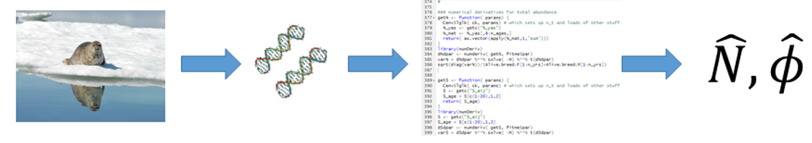

We will be building this site out over the next several months, intending
to place a whole series of examples that will let researchers and managers
new to CKMR familiarize themselves with its principles and practice, and to learn how to code CKMR models in R and TMB 

```{r setup, include=FALSE}
knitr::opts_chunk$set(echo = FALSE)

# Learn more about creating websites with Distill at:
# https://rstudio.github.io/distill/website.html

```

